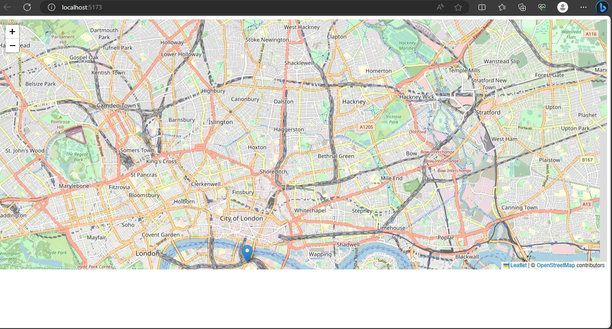

# leafletmap
creating maps using leaflet.js

Leaflet is the leading open-source JavaScript library for mobile-friendly interactive maps. Weighing just about 42 KB of JS, 
it has all the mapping features most developers ever need.
Leaflet is designed with simplicity, performance and usability in mind.
It works efficiently across all major desktop and mobile platforms,
can be extended with lots of plugins, has a beautiful, easy to use and well-documented API and a simple, readable source code that is a joy to contribute to.
visit here for quick guide on how to utilise this awesome library to your project: https://leafletjs.com/index.html , 

https://react-leaflet.js.org
